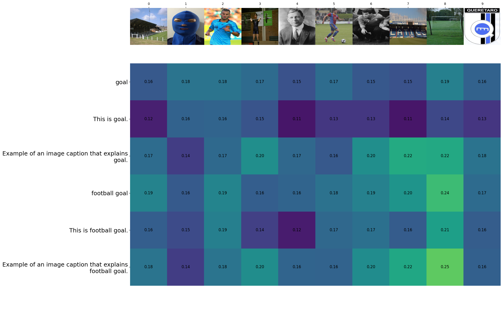

# Visual Word Sense Disambiguation (Visual-WSD): Benchmark and Evaluation Script
This repository contains a baseline to solve Visual Word Sense Disambiguation (V-WSD) and the script to evaluate the results for the V-WSD.

## Get Started
```shell
git clone https://github.com/asahi417/vwsd_experiment
cd vwsd_experiment
pip install .
```

## Baseline with CLIP


<p align="center">
  
</p>

As a baseline to solve V-WSD, we use [CLIP](https://arxiv.org/abs/2103.00020) to compute the text and image embeddings, 
and rank the candidate images based on the cosine similarity between the text and image embeddings.
Following command will run the baseline for each language. 
```shell
vwsd-clip-baseline -l en --plot
vwsd-clip-baseline -l fa --plot
vwsd-clip-baseline -l it --plot
```

## Evaluation
For each query (target word/full phrase) and candidate images, model will assign relevancy scores for all the candidates, which can be evaluated by ranking metrics.
To compute the ranking metrics, run following `vwsd-ranking-metric` command.

```shell
vwsd-ranking-metric -p result/Example_of_an_image_caption_that_explains_mask..target_phrase -r gold.txt
vwsd-ranking-metric -p result/Example_of_an_image_caption_that_explains_mask..target_word -r gold.txt
vwsd-ranking-metric -p result/mask.target_phrase -r gold.txt
vwsd-ranking-metric -p result/mask.target_word -r gold.txt
vwsd-ranking-metric -p result/This_is_mask..target_phrase -r gold.txt
vwsd-ranking-metric -p result/This_is_mask..target_word -r gold.txt
```

### Baseline Results

| model                                                                |   mrr_official/en |   hit_official/en |   hit_rate@1/en |   map@5/en |   mrr@5/en |   ndcg@5/en |   map@10/en |   mrr@10/en |   ndcg@10/en |   mrr_official/fa |   hit_official/fa |   hit_rate@1/fa |   map@5/fa |   mrr@5/fa |   ndcg@5/fa |   map@10/fa |   mrr@10/fa |   ndcg@10/fa |   mrr_official/it |   hit_official/it |   hit_rate@1/it |   map@5/it |   mrr@5/it |   ndcg@5/it |   map@10/it |   mrr@10/it |   ndcg@10/it |   mrr_official/avg |   hit_official/avg |   hit_rate@1/avg |   map@5/avg |   mrr@5/avg |   ndcg@5/avg |   map@10/avg |   mrr@10/avg |   ndcg@10/avg |
|:---------------------------------------------------------------------|------------------:|------------------:|----------------:|-----------:|-----------:|------------:|------------:|------------:|-------------:|------------------:|------------------:|----------------:|-----------:|-----------:|------------:|------------:|------------:|-------------:|------------------:|------------------:|----------------:|-----------:|-----------:|------------:|------------:|------------:|-------------:|-------------------:|-------------------:|-----------------:|------------:|------------:|-------------:|-------------:|-------------:|--------------:|
| result/Example_of_an_image_caption_that_explains_mask..target_phrase |          0.668163 |          0.50324  |        0.50324  |   0.652592 |   0.652592 |    0.71162  |    0.668163 |    0.668163 |     0.748529 |          0.38905  |             0.185 |           0.185 |   0.342583 |   0.342583 |    0.419426 |    0.38905  |    0.38905  |     0.531431 |          0.37596  |          0.190164 |        0.190164 |   0.320492 |   0.320492 |    0.382175 |    0.37596  |    0.37596  |     0.519219 |           0.477724 |           0.292801 |         0.292801 |    0.438556 |    0.438556 |     0.504407 |     0.477724 |     0.477724 |      0.599726 |
| result/Example_of_an_image_caption_that_explains_mask..target_word   |          0.483614 |          0.291577 |        0.291577 |   0.44964  |   0.44964  |    0.521259 |    0.483614 |    0.483614 |     0.604849 |          0.363502 |             0.165 |           0.165 |   0.314083 |   0.314083 |    0.389235 |    0.363502 |    0.363502 |     0.510824 |          0.305109 |          0.134426 |        0.134426 |   0.236448 |   0.236448 |    0.289363 |    0.305109 |    0.305109 |     0.461987 |           0.384075 |           0.197001 |         0.197001 |    0.33339  |    0.33339  |     0.399953 |     0.384075 |     0.384075 |      0.525887 |
| result/mask.target_phrase                                            |          0.738763 |          0.604752 |        0.604752 |   0.728582 |   0.728582 |    0.777656 |    0.738763 |    0.738763 |     0.802202 |          0.466974 |             0.285 |           0.285 |   0.431917 |   0.431917 |    0.505394 |    0.466974 |    0.466974 |     0.591721 |          0.426063 |          0.22623  |        0.22623  |   0.384809 |   0.384809 |    0.457448 |    0.426063 |    0.426063 |     0.559699 |           0.543933 |           0.371994 |         0.371994 |    0.515102 |    0.515102 |     0.580166 |     0.543933 |     0.543933 |      0.651207 |
| result/mask.target_word                                              |          0.544272 |          0.354212 |        0.354212 |   0.518862 |   0.518862 |    0.588232 |    0.544272 |    0.544272 |     0.652186 |          0.389635 |             0.205 |           0.205 |   0.345833 |   0.345833 |    0.421285 |    0.389635 |    0.389635 |     0.530641 |          0.292006 |          0.114754 |        0.114754 |   0.22541  |   0.22541  |    0.281829 |    0.292006 |    0.292006 |     0.451744 |           0.408638 |           0.224655 |         0.224655 |    0.363369 |    0.363369 |     0.430449 |     0.408638 |     0.408638 |      0.544857 |
| result/This_is_mask..target_phrase                                   |          0.746562 |          0.613391 |        0.613391 |   0.737221 |   0.737221 |    0.786229 |    0.746562 |    0.746562 |     0.808288 |          0.431677 |             0.23  |           0.23  |   0.39675  |   0.39675  |    0.478827 |    0.431677 |    0.431677 |     0.565028 |          0.44585  |          0.236066 |        0.236066 |   0.40694  |   0.40694  |    0.481727 |    0.44585  |    0.44585  |     0.576038 |           0.541363 |           0.359819 |         0.359819 |    0.513637 |    0.513637 |     0.582261 |     0.541363 |     0.541363 |      0.649784 |
| result/This_is_mask..target_word                                     |          0.534535 |          0.343413 |        0.343413 |   0.507883 |   0.507883 |    0.57969  |    0.534535 |    0.534535 |     0.644897 |          0.38375  |             0.195 |           0.195 |   0.337167 |   0.337167 |    0.410074 |    0.38375  |    0.38375  |     0.52592  |          0.347077 |          0.15082  |        0.15082  |   0.285137 |   0.285137 |    0.344631 |    0.347077 |    0.347077 |     0.496778 |           0.421787 |           0.229744 |         0.229744 |    0.376729 |    0.376729 |     0.444798 |     0.421787 |     0.421787 |      0.555865 |

## Citation

Please cite the following paper if you use the data or code in this repo.

```
@inproceedings{raganato-etal-2023-semeval,
    title = "{S}em{E}val-2023 {T}ask 1: {V}isual {W}ord {S}ense {D}isambiguation",
    author = "Raganato, Alessandro  and
      Calixto, Iacer and
      Ushio, Asahi and
      Camacho-Collados, Jose  and
      Pilehvar, Mohammad Taher",
    booktitle = "Proceedings of the 17th International Workshop on Semantic Evaluation (SemEval-2023)",
    month = jul,
    year = "2023",
    address = "Toronto, Canada",
    publisher = "Association for Computational Linguistics",
}
```
