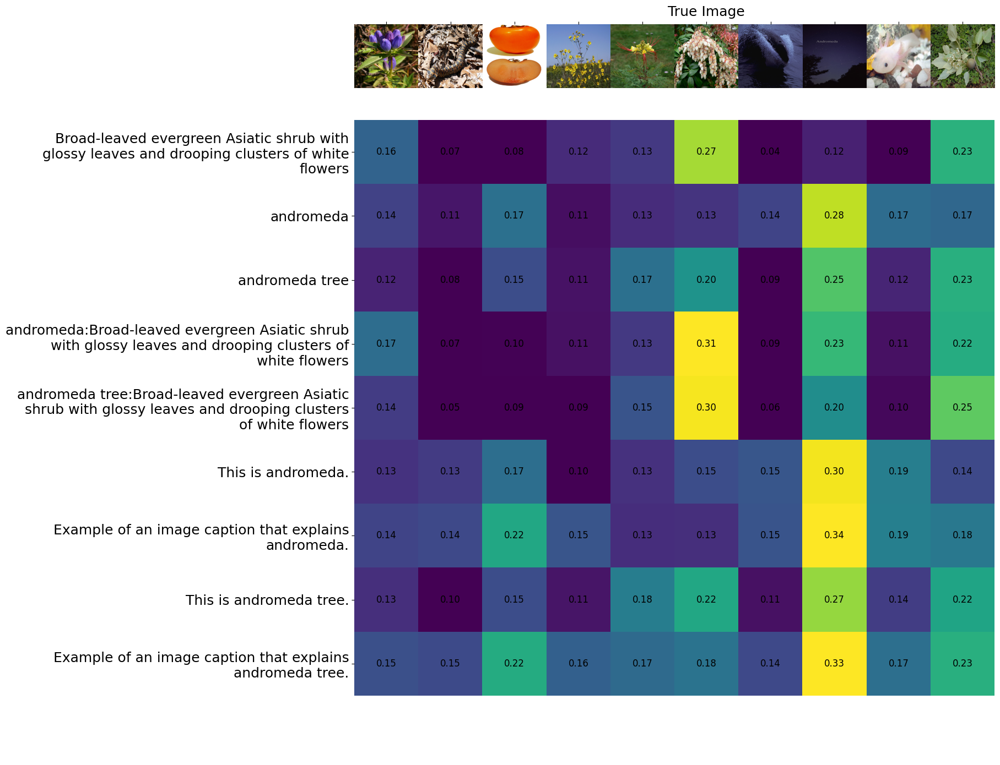

# Visual Word Sense Disambiguation (Visual-WSD): Benchmark and Evaluation Script
This repository contains a baseline to solve Visual Word Sense Disambiguation (V-WSD) and the script to evaluate the results for the V-WSD.

## Get Started
```shell
git clone https://github.com/asahi417/vwsd_experiment
cd vwsd_experiment
pip install .
```

## Run
```shell
vwsd-clip-baseline -l en
```

## Baseline with CLIP


<p align="center">
  
</p>

As a baseline to solve V-WSD, we compute the cosine similarity of each candidate image, and the target phrase (or description) 
with [CLIP](https://arxiv.org/abs/2103.00020), and consider the image with the highest similarity as the prediction. This baseline can be 
obtained by following `vwsd-clip-baseline` command.
```shell
vwsd-clip-baseline [-h] [-d DATA_DIR] [-a ANNOTATION_FILE] [-m MODEL_CLIP] [-e EXPORT_DIR] [-p PROMPT [PROMPT ...]] [-b BATCH_SIZE]

optional arguments:
  -h, --help            show this help message and exit
  -d DATA_DIR, --data-dir DATA_DIR
                        directly of images
  -a ANNOTATION_FILE, --annotation-file ANNOTATION_FILE
                        annotation file
  -m MODEL_CLIP, --model-clip MODEL_CLIP
                        clip model
  -e EXPORT_DIR, --export-dir EXPORT_DIR
                        export directly
  -p PROMPT [PROMPT ...], --prompt PROMPT [PROMPT ...]
                        prompt to be used in text embedding (specify the placeholder by <>)
  --input-type INPUT_TYPE [INPUT_TYPE ...]
                        input text type
  -b BATCH_SIZE, --batch-size BATCH_SIZE
                        batch size
  --skip-default-prompt
                        skip testing preset prompts 
```

For example, baselines over CLIP model available on huggingface at the moment can be obtained by running commands below.
```shell
vwsd-clip-baseline --prompt 'This is <>.' 'Example of an image caption that explains <>.' -m 'openai/clip-vit-base-patch16' -e 'result/clip_vit_base_patch16'
vwsd-clip-baseline --prompt 'This is <>.' 'Example of an image caption that explains <>.' -m 'openai/clip-vit-base-patch32' -e 'result/clip_vit_base_patch32'
vwsd-clip-baseline --prompt 'This is <>.' 'Example of an image caption that explains <>.' -m 'openai/clip-vit-large-patch14' -e 'result/clip_vit_large_patch14'
vwsd-clip-baseline --prompt 'This is <>.' 'Example of an image caption that explains <>.' -m 'openai/clip-vit-large-patch14-336' -e 'result/clip_vit_large_patch14_336'  
```

## Evaluation
For each query (target word/full phrase) and candidate images, model will assign relevancy scores for all the candidates, which can be evaluated by ranking metrics.
To compute the ranking metrics, run following `vwsd-ranking-metric` command.

```shell
vwsd-ranking-metric [-h] [-r RANKING_FILES [RANKING_FILES ...]] [-m METRICS [METRICS ...]] [-e EXPORT]

compute ranking metrics

optional arguments:
  -h, --help            show this help message and exit
  -r RANKING_FILES [RANKING_FILES ...], --ranking-files RANKING_FILES [RANKING_FILES ...]
                        directly of model prediction
  -m METRICS [METRICS ...], --metrics METRICS [METRICS ...]
                        metrics to report (see https://amenra.github.io/ranx/metrics/)
  -e EXPORT, --export EXPORT
                        export file
```
Model prediction file should be a list of dictionary including 
```shell
{
  "data": 0,
  "gold": "image.172.jpg",
  "candidate": ["image.173.jpg", "image.180.jpg", "image.176.jpg", "image.172.jpg", "image.178.jpg", "image.181.jpg", "image.174.jpg", "image.175.jpg", "image.177.jpg", "image.179.jpg"],
  "relevance": [0.34015846252441406, 0.24420318603515626, 0.23036952972412109, 0.21879930496215821, 0.21160614013671875, 0.2113100242614746, 0.20634710311889648, 0.20474609375, 0.18968523025512696, 0.18504663467407226],
  "prompt": "This is <>.",
  "input_type": "Target word"
}
```

For example, ranking metric of the CLIP baseline can be obtained by running commands below.
```shell
vwsd-ranking-metric -r 'result/*/result.json' -m "hit_rate@1" "map@5" "mrr@5" "ndcg@5" "map@10" "mrr@10" "ndcg@10" -e clip_baseline_result.csv
```

## CLIP Baseline Ranking Metrics
Here is the table to report the ranking metrics across different prompts, input types and CLIP variants.

- Full Phrase (eg. `andromeda tree`, `bank erosion`)

|   hit_rate@1 |   map@5 |   mrr@5 |   ndcg@5 |   map@10 |   mrr@10 |   ndcg@10 | prompt                                        | model                      |
|-------------:|--------:|--------:|---------:|---------:|---------:|----------:|:----------------------------------------------|:---------------------------|
|         56.2 |    72.4 |    72.4 |     77.8 |     73.4 |     73.4 |      80.1 | <>                                            | clip_vit_base_patch32      |
|         56.2 |    66.9 |    66.9 |     73.4 |     67.6 |     67.6 |      75.3 | Example of an image caption that explains <>. | clip_vit_base_patch32      |
|         37.5 |    62   |    62   |     71.6 |     62   |     62   |      71.6 | This is <>.                                   | clip_vit_base_patch32      |
|         50   |    66.7 |    66.7 |     72   |     68.3 |     68.3 |      76   | <>                                            | clip_vit_large_patch14     |
|         43.8 |    58.5 |    58.5 |     65.7 |     60.2 |     60.2 |      69.8 | Example of an image caption that explains <>. | clip_vit_large_patch14     |
|         56.2 |    68.2 |    68.2 |     73.1 |     70   |     70   |      77.2 | This is <>.                                   | clip_vit_large_patch14     |
|         56.2 |    72.1 |    72.1 |     77.6 |     73.1 |     73.1 |      79.8 | <>                                            | clip_vit_base_patch16      |
|         56.2 |    66.7 |    66.7 |     71.8 |     68.6 |     68.6 |      76.1 | Example of an image caption that explains <>. | clip_vit_base_patch16      |
|         50   |    67.4 |    67.4 |     74   |     68.4 |     68.4 |      76.2 | This is <>.                                   | clip_vit_base_patch16      |
|         50   |    67.9 |    67.9 |     74.4 |     68.8 |     68.8 |      76.5 | <>                                            | clip_vit_large_patch14_336 |
|         43.8 |    59.6 |    59.6 |     67.9 |     60.6 |     60.6 |      70.2 | Example of an image caption that explains <>. | clip_vit_large_patch14_336 |
|         62.5 |    71.4 |    71.4 |     75.4 |     73.1 |     73.1 |      79.6 | This is <>.                                   | clip_vit_large_patch14_336 |

- Target Word Only (eg. `andromeda`, `bank`)

|   hit_rate@1 |   map@5 |   mrr@5 |   ndcg@5 |   map@10 |   mrr@10 |   ndcg@10 | prompt                                        | model                      |
|-------------:|--------:|--------:|---------:|---------:|---------:|----------:|:----------------------------------------------|:---------------------------|
|         50   |    61.1 |    61.1 |     66.1 |     64.1 |     64.1 |      72.7 | <>                                            | clip_vit_base_patch32      |
|         50   |    59.1 |    59.1 |     63   |     62   |     62   |      70.7 | Example of an image caption that explains <>. | clip_vit_base_patch32      |
|         37.5 |    50   |    50   |     54.7 |     54.6 |     54.6 |      65.2 | This is <>.                                   | clip_vit_base_patch32      |
|         50   |    57.7 |    57.7 |     61.9 |     61.1 |     61.1 |      70   | <>                                            | clip_vit_large_patch14     |
|         31.2 |    43.4 |    43.4 |     49.6 |     47.4 |     47.4 |      59.5 | Example of an image caption that explains <>. | clip_vit_large_patch14     |
|         37.5 |    49.9 |    49.9 |     56   |     53.3 |     53.3 |      64.2 | This is <>.                                   | clip_vit_large_patch14     |
|         43.8 |    59.1 |    59.1 |     66.1 |     60.5 |     60.5 |      70   | <>                                            | clip_vit_base_patch16      |
|         37.5 |    51   |    51   |     57   |     54.6 |     54.6 |      65.4 | Example of an image caption that explains <>. | clip_vit_base_patch16      |
|         43.8 |    57.8 |    57.8 |     65.1 |     59.5 |     59.5 |      69.2 | This is <>.                                   | clip_vit_base_patch16      |
|         50   |    57.8 |    57.8 |     60.6 |     62.4 |     62.4 |      71.1 | <>                                            | clip_vit_large_patch14_336 |
|         25   |    40.3 |    40.3 |     47.4 |     44.6 |     44.6 |      57.6 | Example of an image caption that explains <>. | clip_vit_large_patch14_336 |
|         37.5 |    50.1 |    50.1 |     57.6 |     52.7 |     52.7 |      63.8 | This is <>.                                   | clip_vit_large_patch14_336 |
